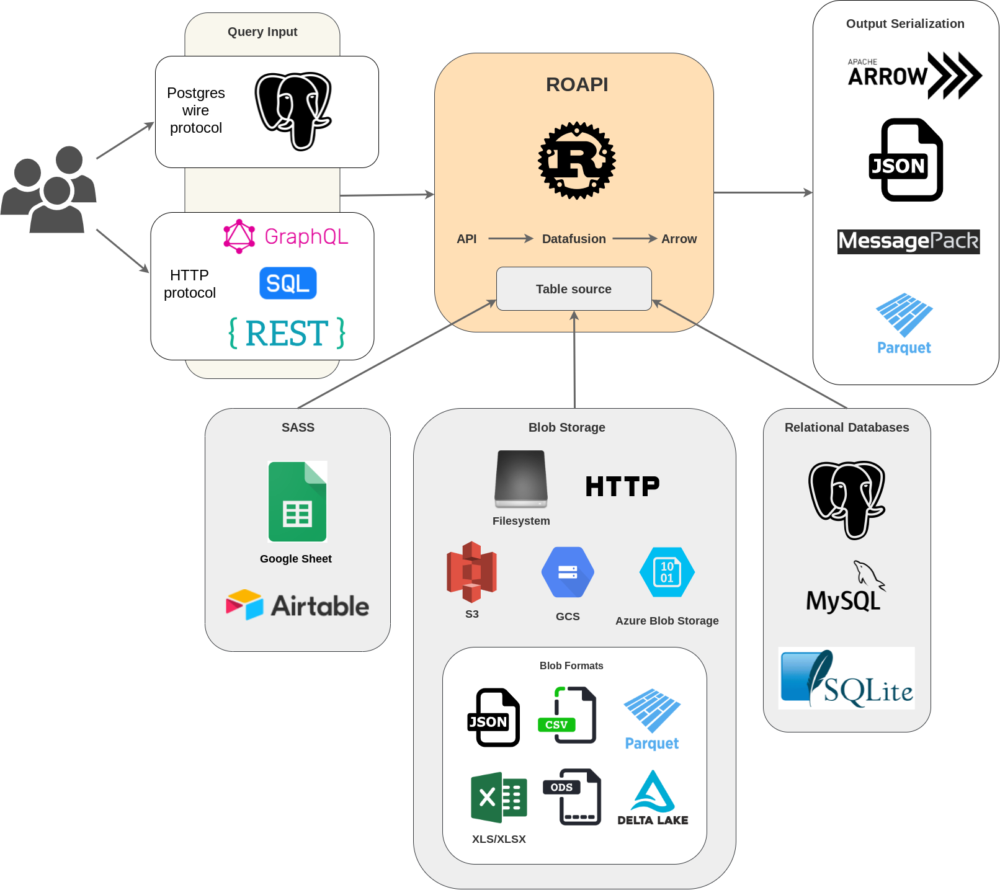

# ROAPI Documentation

[ROAPI](https://github.com/roapi/roapi) automatically spins up read-only APIs
and query frontends for slowly moving datasets without requiring you to write a
single line of code. It builds on top of [Apache Arrow](https://github.com/apache/arrow) and
[Datafusion](https://github.com/apache/arrow-datafusion). The
core of its design can be boiled down to the following:

* Query frontends to translate SQL, GraphQL and REST API queries into
Datafusion plans.
* Datafusion for query plan execution.
* Data layer to load datasets from a variety of sources and formats with
automatic schema inference.
* Response encoding layer to serialize intermediate Arrow record batch into
various formats requested by client.

Its pluggable query core design makes it possible for users to efficiently
perform join queries acorss a diverse set of datasources from simple
CSV/Parquet files in Data warehouses, to MySQL/Postgres, to SASS like Google
spreadsheet.

See below for a high level design diagram:

> If you'd like to share feedback on how you're using ROAPI, please [fill out this survey](https://docs.google.com/forms/d/1M1s1scZX39UouuVF8WzIFQoSyeKX5dMVQgQMtYJKGZU). Thanks!
