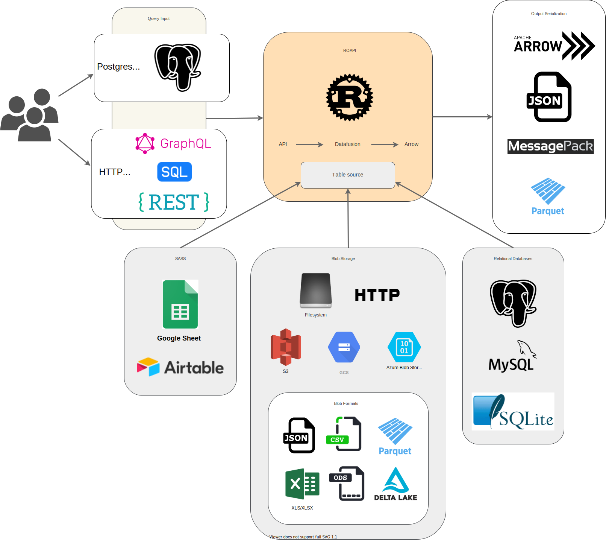

# ROAPI Documentation

[ROAPI](https://github.com/roapi/roapi) automatically spins up read-only APIs
for static datasets without requiring you to write a single line of code. It
builds on top of [Apache Arrow](https://github.com/apache/arrow) and
[Datafusion](https://github.com/apache/arrow/tree/master/rust/datafusion). The
core of its design can be boiled down to the following:

* Query frontends to translate SQL, GraphQL and REST API queries into
Datafusion plans.
* Datafusion for query plan execution.
* Data layer to load datasets from a variety of sources and formats with
automatic schema inference.
* Response encoding layer to serialize intermediate Arrow record batch into
various formats requested by client.

See below for a high level diagram:

