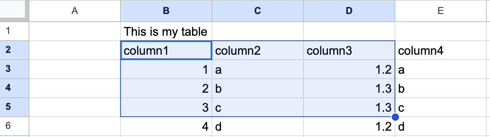

# Excel

ROAPI supports loading Microsoft Excel compatible formats including xls, xlsx, xlsb, and ods files.

```yaml
tables:
  - name: "mytable"
    uri: "path/to/file.xlsx"
    option:
      format: "xlsx"
      sheet_name: "Sheet1"
```

## Supported Formats

- **xls** - Microsoft Excel 5.0/95 Workbook
- **xlsx** - Excel Workbook  
- **xlsb** - Excel Binary Workbook
- **ods** - OpenDocument Spreadsheet

## Sheet Selection

You can specify which sheet to load from the spreadsheet using the `sheet_name` option. By default, ROAPI will use the first sheet if no sheet name is specified.


```yaml
tables:
  - name: "mytable"
    uri: "path/to/file.xlsx"
    option:
      format: "xlsx"
      sheet_name: "MyDataSheet"
```

## Table Range Options

You can specify a specific range of cells to load from the spreadsheet:
You can specify a specific range of cells to load from the spreadsheet:

- **rows_range_start** - The first row of the table containing column names (default: 0)
- **rows_range_end** - The last row of the table (default: all rows)
- **columns_range_start** - The first column of the table (default: 0)  
- **columns_range_end** - The last column of the table (default: all columns)



```yaml
tables:
  - name: "mytable"
    uri: "path/to/file.xlsx"
    option:
      format: "xlsx"
      sheet_name: "Sheet1"
      rows_range_start: 1
      rows_range_end: 4
      columns_range_start: 1
      columns_range_end: 3
```

## Schema Inference

ROAPI can automatically infer the schema from your Excel data. The first row within the specified range is treated as column names, and ROAPI will analyze the remaining rows to determine data types.

You can control schema inference with the `schema_inference_lines` option, which specifies how many rows to analyze (including the header row). For example, `schema_inference_lines: 3` will use the first row for column names and analyze 2 additional rows for data types.

If a column contains mixed data types (like both integers and floats), ROAPI will default to the Utf8 (string) data type.

## Explicit Schema Definition

For better performance and predictable data types, you can define the schema explicitly in your configuration:

```yaml
tables:
  - name: "excel_table"
    uri: "path/to/file.xlsx"
    option:
      format: "xlsx"
    schema:
      columns:
        - name: "int_column"
          data_type: "Int64"
          nullable: true
        - name: "string_column"
          data_type: "Utf8"
          nullable: true
        - name: "float_column"
          data_type: "Float64"
          nullable: true
        - name: "datetime_column"
          data_type: !Timestamp [Seconds, null]
          nullable: true
        - name: "duration_column"
          data_type: !Duration Second
          nullable: true
        - name: "date32_column"
          data_type: Date32
          nullable: true
        - name: "date64_column"
          data_type: Date64
          nullable: true
        - name: "null_column"
          data_type: Null
          nullable: true
```
