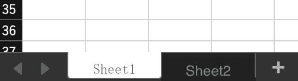

# Xlsx(Microsoft Excel)

Thanks to [calamine](https://github.com/tafia/calamine) crate, ROAPI supports the `.xlsx` file.

To load the `.xlsx`, `sheet_name` needs to be specified in a config.

Ex) Sheet1




```yaml
tables:
    - name: "excel_table"
      uri: "path/to/file.xlsx"
      option:
        format: "xlsx"
        sheet_name: "Sheet1"
```


If no `sheet_name` is specified, ROAPI will throw the error.